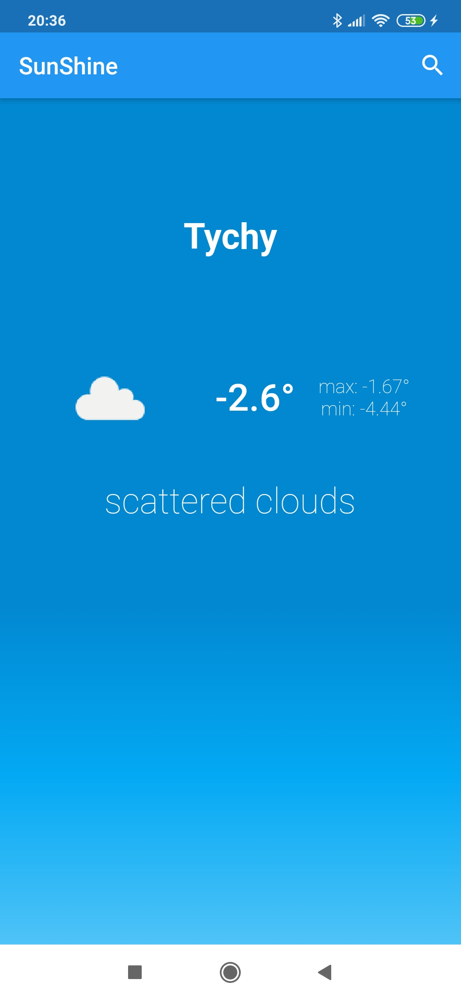

# sunshine

Simple weather application using Bloc architecture.

## Getting Started

Project is based on google Flutter framework.

Project structure:
- backend (Folder for business logic)
- config  (App configuration)
- data    (Sqflite database helper)
- models  (models for parsing api json)
- repository (open weathermap comunication methods)
- screen    (application screens)
- widgets   (single costume widgets build due tue )
- main.dart (entry point to application)
- simple_bloc_delegate.dart (bloc architecture delegate for debug purpose)

Application has dynamic theming based on weather condition.
## View on welcome page animation

## View on weather view with dynamic theme

## Dynamic Theming example 1

## Dynamic Theming example 2

## Dynamic Theming example 3

## View on City list and search form during city deleting

## Filling the form

## Everyday notification depends on geo localisation. Clicking on notification opens app. After getting localisation shows weather condition

## Getting from user permission to reach hardware localisation

Scroll down on weather screen performs two functionality, adding localisation
to database and refreshing weather data. Added city can be deleted on CitySelection.
Cities list wrapped my ListView builder with card children. Tapping on city card performs weather checking operation.

